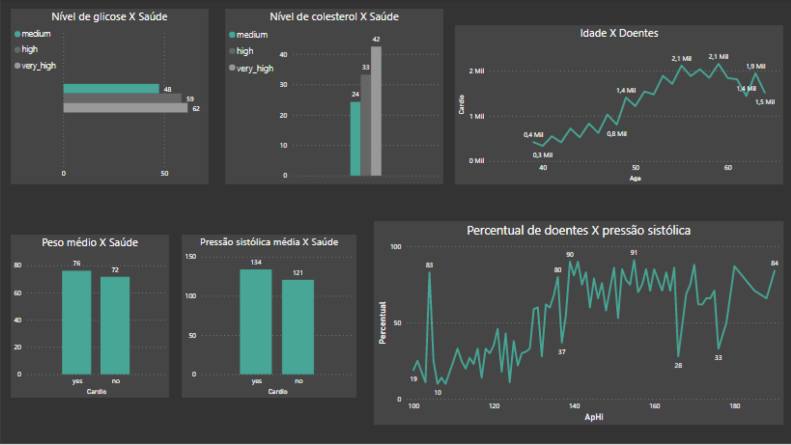
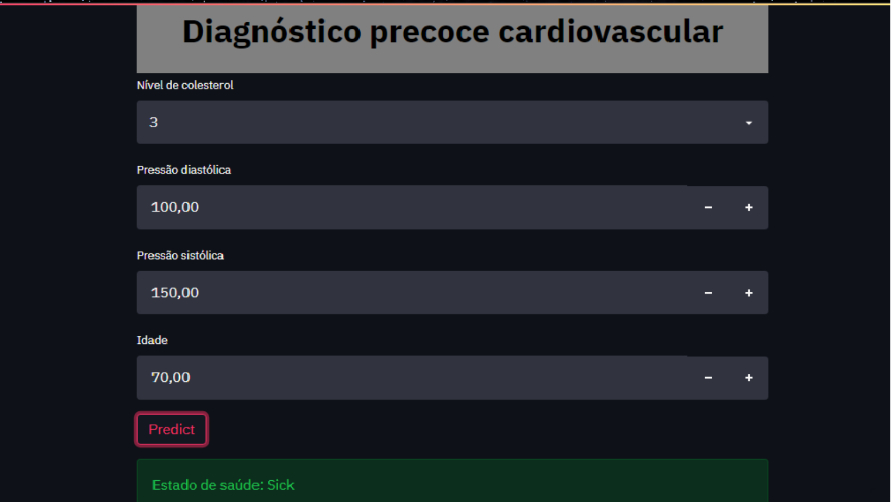

## Introdução:
Atualmente com o  maior poder de processamento de dados, é possível a criação de ferramentas estatísticas que podem automatizar e aumentar a precisão de trabalhos humanos.
Pensando nisso, resolvi utilizar essas tecnologias visando a melhoria de  tarefas no setor médico.
## Problema de negócio:
A Cadio Catch Diseases é uma empresa especializada em detecção de doenças cardíacas em estágios iniciais. O seu modelo de negócio é do tipo Serviço, ou seja, a empresa ofereço o diagnóstico precoce de uma doença cardiovascular por um certo preço.

Atualmente, o diagnóstico de uma doença cardiovascular é feita manualmente por uma equipe de especialistas. A precisão atual do diagnóstico varia entre 55% e 65%, devido à complexidade do diagnóstico e também da fadiga da equipe que se revezam em turnos para minimizar os riscos. O custo de cada diagnóstico, incluindo os aparelhos e a folha de pagamento dos analistas, gira em torno de R$ 1.000,00.

O preço do diagnóstico, pago pelo cliente, varia conforme a precisão conseguida pelo time de especialistas, o cliente paga R$500,00 a cada 5% de acurácia acima de 50%. Por exemplo, para uma precisão de 55%, o diagnóstico custa R$500,00 para o cliente, para uma precisão de 60%, o valor é de R$ 1000,00 e assim por diante. Se a precisão do diagnóstico for 50% o cliente não paga por ele.

## Métricas a serem superadas:
- Precision: 0,5 
- Accuracy: 0,5

## Features disponíveis:
- Idade
- Peso 
- Altura
- Gênero 
- Pressão sistólica e diastólica
- Nível de colesterol e glicose
- Fumante
- Praticante de esportes
- Consumidor de bebidas alcoólicas

# Proposta de solução:
## Definição da entrega:
- Dashboard demonstrando o comportamento das principais features.
- Insights com a quebra de crença baseado em hipóteses.
- Aplicação Web, onde o médico irá inserir os dados e ter a predição em tempo real.
- Demonstração da melhoria das métricas.

## Tecnologias empregadas:
- Linguagem : Python 3.7.12
- Principais bibliotecas: sklearn, xgboost, flask,
seaborn, requests, pandas, e numpy.
- Ide: Google colab
- Backend da aplicação : Streamlit
- Cloud da aplicação (ML) : Heroku
- Mapas mentais: Google coggle
- Dashboard: PowerBI
- Imagens: Canva
- Versionamento de código: GitHub
- Modelo escolhido : XGBClassifier
## Desafios enfrentados:
- Desbalanceamento das classes: Foi utilizado como solução o recurso de undersapling 
NearMiss
- Predição de apenas um frame. Na preparação das features numéricas foi utilizado a transformação logarítmica.  
- Poucas features que explicavam o fenômeno: Criação de features categóricas baseadas na idade e pressão sistólica, foi utilizado um feature selector RFE.

# Resultados
## Insights:
### Features com maiores impactos no fenômeno :
- Pressão sistólica, colesterol, idade, glicose,  e peso.
### Features que existem correlação entre si (Escala de 0,0 há 1,0):
- Glicose com colesterol  (0,39)
- Fumante com gênero  ( 0,34)
- Pressão sistólica com diastólica  (0,62)
### Quebra de paradigmas:
- Fumantes e consumidores de bebidas alcoólicas não possuem relação estatística com o fenômeno.

### Dashboard das principais features:

## Produto de Machine learning:
### Métrica alcançadas:
- Precision: 0,75
- Recall: 0,69
- Accuracy : 0,73

### Dinheiro ganho com a nova ferramenta:
- R$ 2334.11 por exame

### Demonstração da aplicação:
 - Através do fornecimento de um link ,o usuário é levado a uma página web onde é possível a inserção dos dados do paciente, apos o clique no botão "predict", é gerado o resultado do estado de saúde do paciente na tela.

#### Link da aplicação :
https://share.streamlit.io/andriw-afonso/studies/main/teste-app/streamlit/app.py

# Próximos passos:
- Coleta de dados dos níveis numéricos de colesterol e glicose para o retreino do modelo.

# Referências

- Meigarom Lopes . Projeto de Data Science: Diagnóstico Precoce de Doenças Cardiovasculares , em 
 https://sejaumdatascientist.com/projeto-de-data-science-diagnostico-precoce-de-doencas-cardiovasculares/
