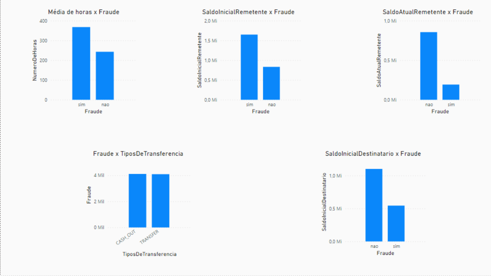
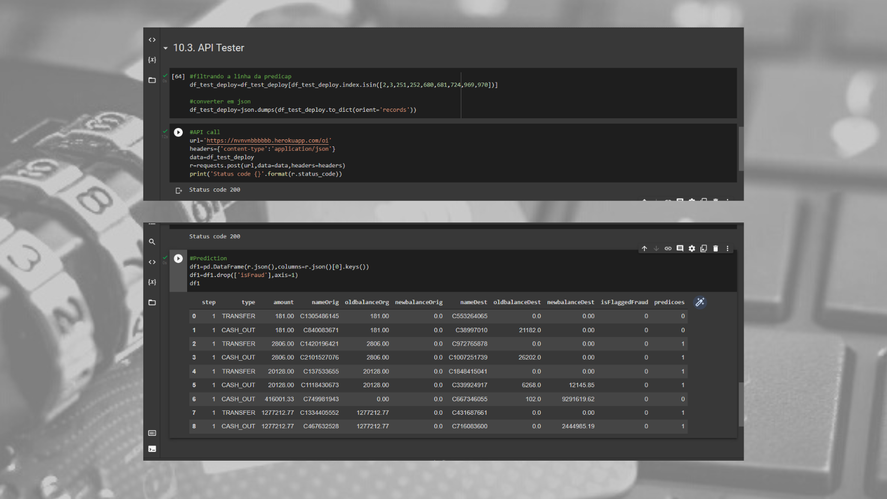
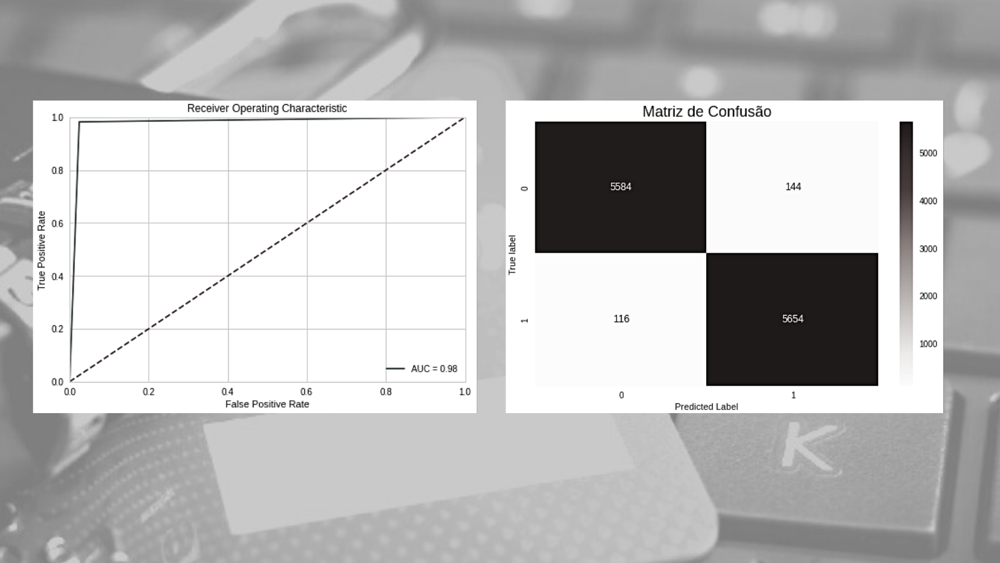

# Introdução:
## Problema de negócio:
A Blocker Fraude Company é uma empresa especializada na detecção de fraudes em transações financeiras feitas através de dispositivos móveis. A empresa tem um serviço chamado “Blocker Fraud” no qual garante o bloqueio de transações fraudulentas.

E o modelo de negócio da empresa é do tipo Serviço com a monetização feita por performance do serviço prestado, ou seja, o usuário paga uma taxa fixa sobre o sucesso na detecção de fraude das transações do cliente.

Porém, a Blocker Fraud Company está em fase de expansão no Brasil e para adquirir clientes mais rapidamente, ela adotou uma estratégia muito agressiva. A estratégia funciona da seguinte forma:

- A empresa vai receber 25% do valor de cada transação detectada verdadeiramente como fraude.
- A empresa vai receber 5% do valor de cada transação detectada como fraude, porém a transação é verdadeiramente legítima.
- A empresa vai devolver 100% do valor para o cliente, a cada transação detectada como legítima, porém a transação é verdadeiramente uma fraude.

Com essa estratégia agressiva a empresa assume os riscos em falhar na detecção de fraude e é remunerada na detecção assertiva das fraudes.

Para o cliente, é um excelente negócio contratar a Blocker Fraud Company. Apesar da taxa cobrada ser muito alta sobre o sucesso, 25%, a empresa reduz seus custos com transações fraudulentas detectadas corretamente e ainda o prejuízo causado por um erro do serviço de anti-fraude será coberto pela própria Blocker Fraud Company.

Para a empresa, além de conseguir muitos clientes com essa estratégia arriscada em garantir o reembolso no caso de uma falha na detecção de fraude do cliente, ela depende somente da precisão e da acurácia dos modelos construídos pelos seus Cientistas de Dados, ou seja, quanto mais preciso for o modelo “Blocker Fraud”, maior o faturamento da empresa. Porém, se o modelo tiver baixa precisão, a empresa poderá ter um prejuízo enorme.

## O Desafio
Você foi contratado como um Consultor de Ciência de Dados para criar um modelo de alta precisão e acurácia na detecção de fraudes de transações feitas através de dispositivos móveis.

Ao final da sua consultoria, você precisa entregar ao CEO da Blocker Fraud Company um modelo em produção no qual seu acesso será feito via API, ou seja, os clientes enviarão suas transações via API para que o seu modelo as classifique como fraudulentas ou legítimas.

Além disso, você precisará entregar um relatório reportando a performance e os resultados do seu modelo em relação ao lucro e prejuízo que a empresa terá ao usar o modelo que você produziu. No seu relatório deve conter as respostas para as seguintes perguntas:

- Qual a Precisão e Acurácia do modelo?
- Qual a Confiabilidade do modelo em classificar as transações como legítimas ou fraudulentas?
- Qual o Faturamento Esperado pela Empresa se classificarmos 100% das transações com o modelo?
- Qual o Prejuízo Esperado pela Empresa em caso de falha do modelo?
- Qual o Lucro Esperado pela Blocker Fraud Company ao utilizar o modelo?

## Features disponíveis:
### link do dataset : https://drive.google.com/file/d/19e9fRSiGpbORIZDQWC8fWwDahwjo2jSr/view
- step: Unidade de tempo em horas.
- type: Tipo da transação 
- amount: Valor a ser transferido
- nameOrig: Código do cliente que irá transferir. 
- oldbalanceOrg: Saldo inicial do remetente
- newbalanceOrig :  Saldo do remetente após a transferência. 
- nameDest: Código do cliente destinatário 
- oldbalanceDest : Saldo inicial do destinatário
- newbalanceDest: Saldo do destinatário após a transferência.
- isFraud: Fraude 
- isFlaggedFraud: Indicativo que a operação é acima de 200 000.

# Proposta de solução:
## Definição da entrega:
- Relatório respondendo às perguntas propostas.
- Dashboard com os maiores insights.
- Lista das features de maior impacto no fenômeno.
- API que realiza predições através de uma URL.
- Demonstração da melhoria das métricas.

## Tecnologias empregadas:
- Linguagem : Python 3.7.12
- Principais bibliotecas: sklearn, Pycaret, flask,
seaborn, requests, pandas, e numpy.
- Ide: Google colab
- Cloud da aplicação (ML) : Heroku
- Mapas mentais: Google coggle
- Dashboard: PowerBI
- Imagens: Canva
- Versionamento de código: GitHub
- Modelo escolhido : RandomForestClassifier

## Desafios enfrentados:
- Desbalanceamento das classes: Foi utilizado como solução o recurso de undersapling 
NearMiss

# Resultados
## Report:
1- Qual a Precisão e Acurácia do modelo?
- Precisão: 0.97 e Acurácia: 0.98

2- Qual a Confiabilidade do modelo em classificar as transações como legítimas ou fraudulentas?
- Confiabilidade: 0.98

3- Qual o Faturamento Esperado pela Empresa se classificarmos 100% das transações com o modelo?
- Percentual de faturamento em relação ao montante: 21.51 %

 4- Qual o Prejuízo Esperado pela Empresa em caso de falha do modelo?
 - Perda percentual em relação ao montante:  0.1 %

Qual o Lucro Esperado pela Blocker Fraud Company ao utilizar o modelo?
- Ganho percentual em relação ao montante:  21.34 %
## Insights :
- Os tipos de transações que mais ocorrem fraudes são TRANSFER e CASH_OUT.
- Quanto maior o saldo inicial do remetente, maior é a hipótese de fraude.
- Quanto maior  a etapa de medição, maior é a hipótese de fraude.
- Quanto menor o saldo inicial do destinatário, maior é a hipótese de fraude.
- Quanto menor o saldo atual do remetente, maior é a hipótese de fraude.

## Features mais importantes (Score importance):
- Saldo inicial do remetente (0.49894)
- Montante (0.23942)
- Saldo atual do remetente (0.20692)
- Saldo atual  do destinatario (0.03619)

## Produto de Machine learning:
### Demonstração da aplicação:
####  Para utilizar a API é necessário: 
- Converter os dados para o formato json.
- Realizar uma request com o método post na url : 
https://nvnvnbbbbbb.herokuapp.com/oi
- Converter o dado no formato json em csv para visualizar as predições.

### Métricas a serem superadas (baseline):
- F1-score: 0.49
- Precision: 0.49
- Recall: 0.50

### Métrica alcançadas:
- F1-score: 0.98+/-0.0
- Precision: 0.97+/-0.0
- Recall: 0.98+/-0.0

# Referências

- Meigarom Lopes .Crie uma Solução para Fraudes em Transações Financeiras usando Machine Learning , em 
https://sejaumdatascientist.com/crie-uma-solucao-para-fraudes-em-transacoes-financeiras-usando-machine-learning/
