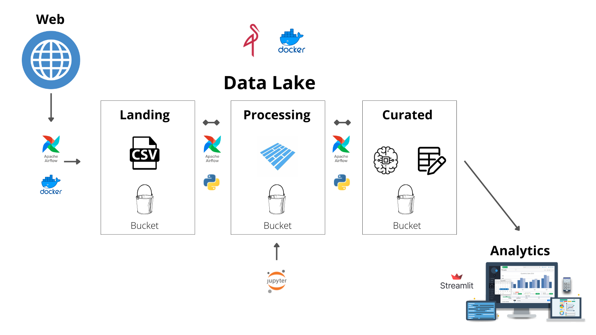

# Objetivo:
O objetivo do projeto é predizer os valores diários de máximo, mínimo e fechamento das ações da Petrobras.

# Proposta de solução:
## Criar um Pape line de dados onde:
- A coleta de dados e feita por meio da API do Yahoo
- O armazenamento e feito em um data lake com as zonas landing, processing e curated.
- As predições do modelo são apresentadas em um Dahsborad de acompanhamento.

# Execução do projeto:
## Arquitetura e tecnologias envolvidas:
- Infra estrutura: Apache Airflow, MinIO e Docker.
- Linguagem: Python 3.6.13 ( statsmodels, sklearn, e Matplotlib)
- Modelo escolhido :  SARIMA
- Front-end da aplicação :  Streamlit
- IDE: Jupyter notebook
- Versionamento de código: GitHub
- Imagens: Canva

### Overview:

### Resumo do funcionamento:
- Coleta de dados na api do yahoo e armazenamento na zona landing do datalake.
- Transformação dos dados para o formato Parquet e armazenamento na zona processing do datalake.
- Os modelos são treinados e salvos na zona curated no data lake.
- Os modelos realizam suas predições, as mesmas são armazenadas em um dataset na zona curated no data lake.
- A aplicação coleta os dados das métricas dos modelos na zona curated e demonstra em um dashboard de acompanhamento de performance. 

## Métricas do modelo:

## Funcionamento do app:

