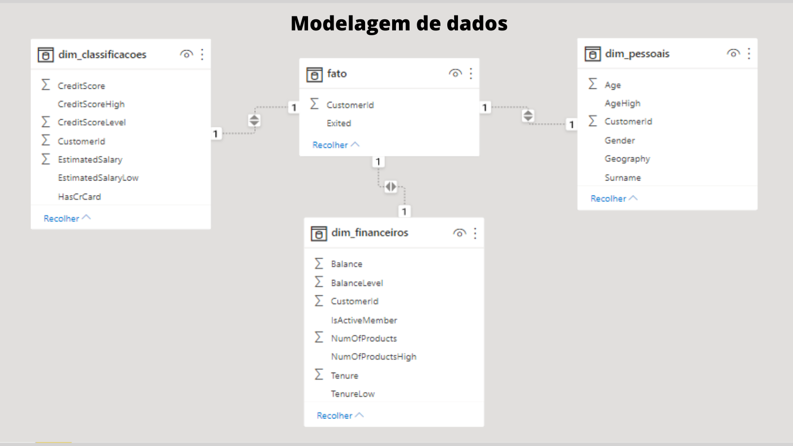
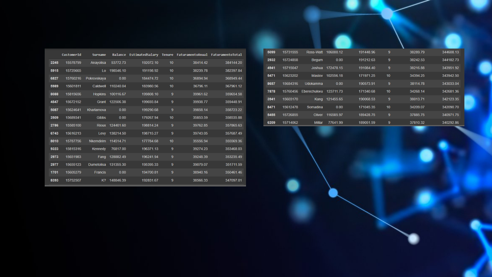
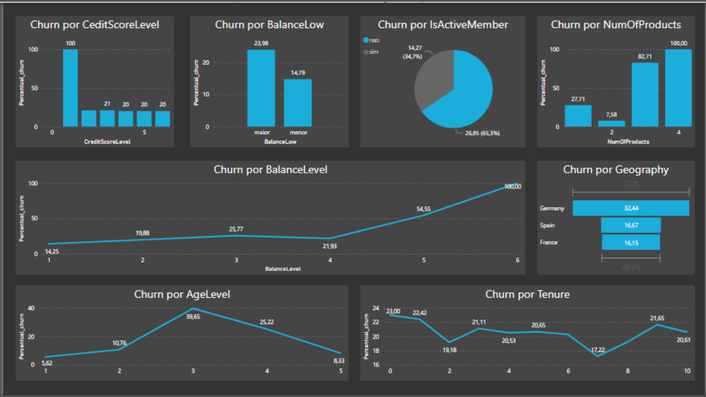
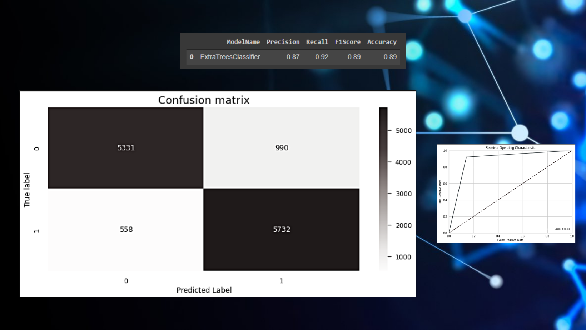
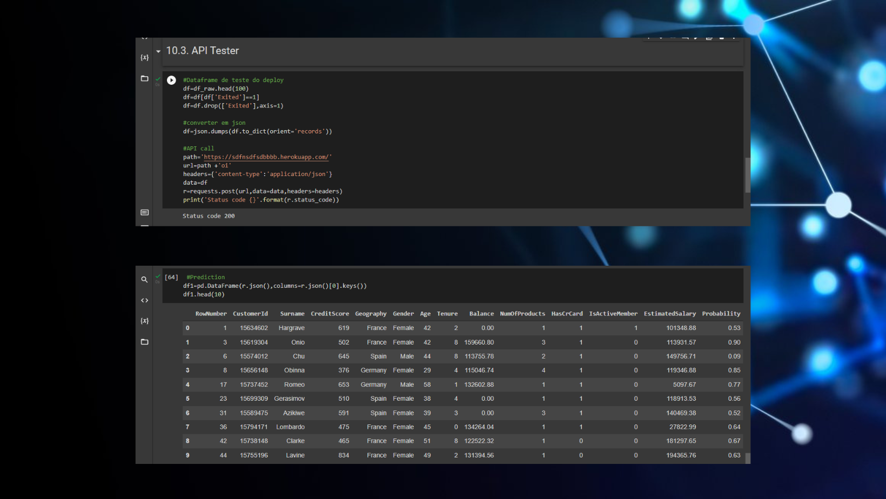

# Introdução:
## Contexto:
A TopBank é uma grande empresa de serviços bancários. Ela atua principalmente nos países da Europa oferecendo produtos financeiros, desde contas bancárias até investimentos, passando por alguns tipos de seguros e produto de investimento.

O modelo de negócio da empresa é do tipo serviço, ou seja, ela comercializa serviços bancários para seus clientes através de agências físicas e um portal online. 

O principal produto da empresa é uma conta bancária, na qual o cliente pode depositar seu salário, fazer saques, depósitos e transferência para outras contas. Essa conta bancária não tem custo para o cliente e tem uma vigência de 12 meses, ou seja, o cliente precisa renovar o contrato dessa conta para continuar utilizando pelos próximos 12 meses.

Segundo o time de Analytics da TopBank, cada cliente que possui essa conta bancária retorna um valor monetário de 15% do valor do seu salário estimado, se esse for menor que a média e 20% se esse salário for maior que a média, durante o período vigente de sua conta. Esse valor é calculado anualmente. 

Por exemplo, se o salário mensal de um cliente é de R$1.000,00 e a média de todos os salários do banco é de R$800. A empresa, portanto, fatura R$ 200 anualmente com esse cliente. Se esse cliente está no banco há 10 anos, a empresa já faturou R$2.000,00 com suas transações e utilização da conta. 

Nos últimos meses, o time de Analytics percebeu que a taxa de clientes cancelando suas contas e deixando o banco, atingiu números inéditos na empresa. Preocupados com o aumento dessa taxa, o time planejou um plano de ação para diminuir taxa de evasão de clientes.

Preocupados com a queda dessa métrica, o time de Analytics da TopBottom, contratou você como consultor de Data Science para criar um plano de ação, com o objetivo de reduzir a evasão de clientes, ou seja, impedir que o cliente cancele seu contrato e não o renove por mais 12 meses. Essa evasão, nas métricas de negócio, é conhecida como Churn.

De maneira geral, Churn é uma métrica que indica o número de clientes que cancelaram o contrato ou pararam de comprar seu produto em um determinado período de tempo. Por exemplo, clientes que cancelaram o contrato de serviço ou após o vencimento do mesmo, não renovaram, são clientes considerados em churn.

Outro exemplo seria os clientes que não fazem uma compra à mais de 60 dias. Esse clientes podem ser considerados clientes em churn até que uma compra seja realizada. O período de 60 dias é totalmente arbitrário e varia entre empresas. 

## Problema de negócio:
Como um Consultor de Ciência de Dados, você precisa criar um plano de ação para diminuir o número de clientes em churn e mostrar o retorno financeiro da sua solução.

Ao final da sua consultoria, você precisa entregar ao CEO da TopBottom um modelo em produção, que receberá uma base de clientes via API e retornará essa mesma base “scorada”, ou seja, um coluna à mais com a probabilidade de cada cliente entrar em churn.

Além disso, você precisará fornecer um relatório reportando a performance do seu modelo e o impacto financeiro da sua solução. Questões que o CEO e o time de Analytics gostariam de ver em seu relatório:

- Qual a taxa atual de Churn da TopBank? Como ela varia mensalmente?
- Qual a Performance do modelo em classificar os clientes como churns?
- Qual o retorno esperado, em termos de faturamento, se a empresa utilizar seu modelo para evitar o churn dos clientes?
- Uma possível ação para evitar que o cliente entre em churn é oferecer um cupom de desconto, ou alguma outro incentivo financeiro para ele renovar seu contrato por mais 12 meses.Para quais clientes você daria o incentivo financeiro e qual seria esse valor, de modo a maximizar o ROI (Retorno sobre o investimento). Lembrando que a soma dos incentivos não pode ultrapassar os  R$10.000,00.

## Features disponíveis:
### link do dataset : https://www.kaggle.com/mervetorkan/churndataset
- RowNumber: O número da coluna
- CustomerID: Identificador único do cliente
- Surname: Sobrenome do cliente.
- CreditScore: A pontuação de Crédito do cliente para o mercado de consumo.
- Geography: O país onde o cliente reside.
- Gender: O gênero do cliente.
- Age: A idade do cliente.
- Tenure: Número de anos que o cliente permaneceu ativo.
- Balance: Valor monetário que o cliente tem em sua conta bancária.
- NumOfProducts: O número de produtos comprado pelo cliente no banco.
- HasCrCard: Indica se o cliente possui ou não cartão de crédito.
- IsActiveMember: Indica se o cliente fez pelo menos uma movimentação na conta bancário dentro de 12 meses.
- EstimateSalary: Estimativa do salário mensal do cliente.
- Exited: Indica se o cliente está ou não em Churn.

# Proposta de solução:
## Definição da entrega:
- Relatório respondendo às perguntas propostas.
- Dashboard com os maiores insights.
- Lista das features de maior impacto no fenômeno.
- API que realiza predições através de uma URL.
- Demonstração da melhoria das métricas.

## Ordem das tarefas:

## Tecnologias empregadas:
- Linguagem : Python 3.7.12
- Principais bibliotecas: sklearn, Pycaret, flask,
seaborn, requests, pandas, e numpy.
- Ide: Google colab
- Cloud da aplicação (ML) : Heroku
- Mapas mentais: Google coggle
- Dashboard: PowerBI
- Imagens: Canva
- Versionamento de código: GitHub
- Modelo escolhido : Extra Trees Classifier

## Desafios enfrentados:
Dados desbalanceados (Exited), foi utilizado a técnica de oversampling  RandomOverSampler.

# Resultados
## Report:
    1- Qual a taxa atual de Churn da TopBank? Como ela varia mensalmente?
    R: Taxa atual de Churn : 20.37 %
    
    2- Qual a Performance do modelo em classificar os clientes como churns?
    R: Recall : 0.93

    3- Qual o retorno esperado, em termos de faturamento, se a empresa utilizar seu modelo para evitar o churn dos clientes?
    R: Valor de faturamento anual considerando a utilização do modelo com 92% dos churns identificados : R$ 35989726.4445

    4- Uma possível ação para evitar que o cliente entre em churn é oferecer um cupom de desconto, ou alguma outro incentivo financeiro para ele renovar seu contrato por mais 12 meses. Para quais clientes você daria o incentivo financeiro e qual seria esse valor, de modo a maximizar o ROI (Retorno sobre o investimento). Lembrando que a soma dos incentivos não pode ultrapassar os  R$10.000,00.
    R: Valor de R$ 250.

## Insights :
- Clientes com CreditScore <= 400 , tem maior chances de entrarem em Churn.
- Clientes com Balance >=70000, tem maior chances de entrarem em Churn.
- 63,3 % dos clientes em Churn , provem de pessoas inativas nos últimos 12 meses.
- A maior parte dos clientes em Churn, provem de pessoas que compraram 3 ou maios produtos.
- O pais com maior taxa de Churn é a Alemanha.
- A maior parte dos clientes em Churn, provem de pessoas de 40 á 60 anos.
- Clientes com 1 ano de atividade tem maiores chances de entrarem em Churn.
- Clientes com 9 anos de atividade também possuem maiores chances de entrarem em Chun.

## Features mais importantes (Score importance):
- Balance: 0.45
- Age: 0.34
- NumOfProducts: 0.14

## Produto de Machine learning:
### Métricas a serem superadas (baseline):
- Recall: 1.0
- F1-Score: 0.67

### Métrica alcançadas:
- Recall: 0.92
- F1-Score: 0.89

### Demonstração da aplicação:

# Conclusão:
Por meio desse projeto foi possível identificar os clientes mais propensos a entrarem em processo de Churn,  com esse conhecimento a empresa poderá otimizar sua estratégia de market para evitar a perda do cliente.

# Referências :

- Meigarom Lopes . Aumente o Faturamento da Empresa com Previsão de Churn, em 
https://sejaumdatascientist.com/predicao-de-churn/

# Contato :
- LinkedIn : https://www.linkedin.com/in/andriwdatascientist/ 
- E-mail: andriw_eng@outlokk.com
