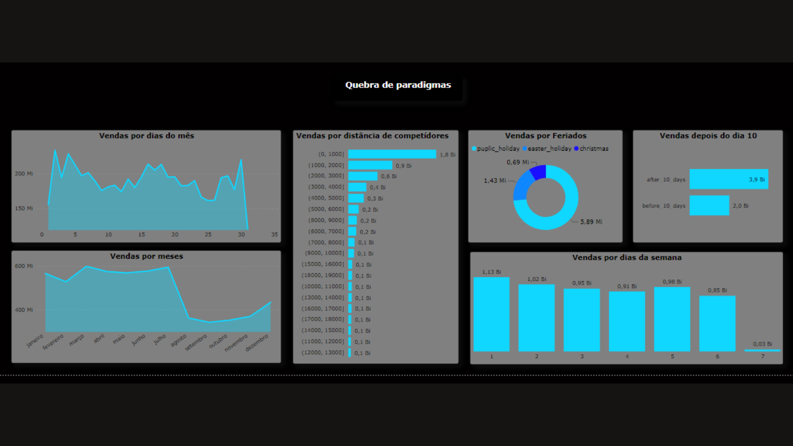
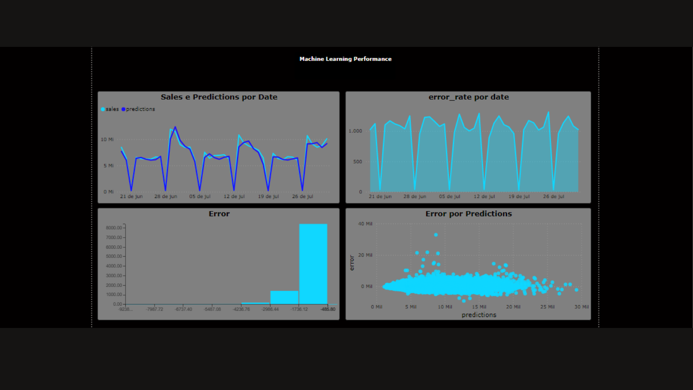
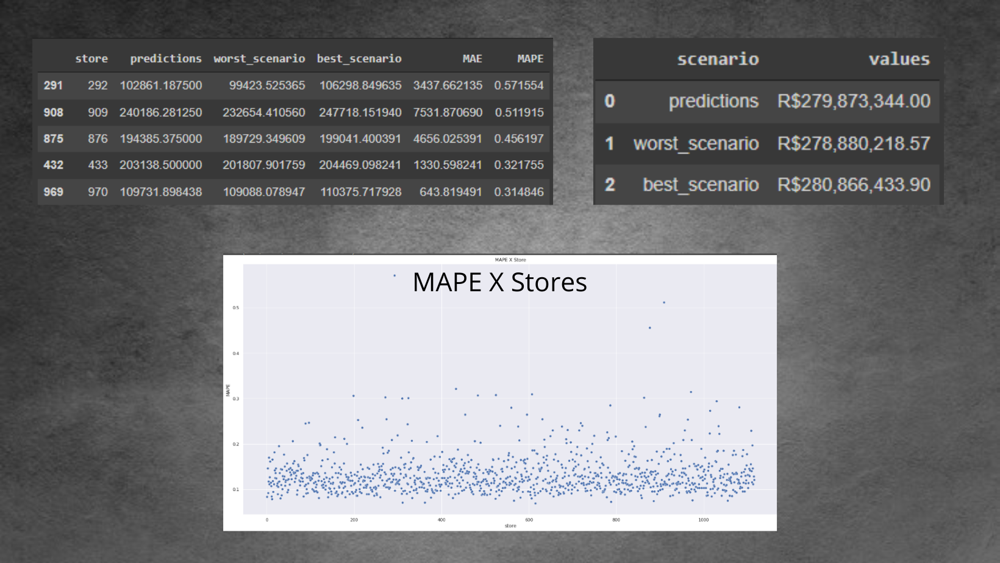
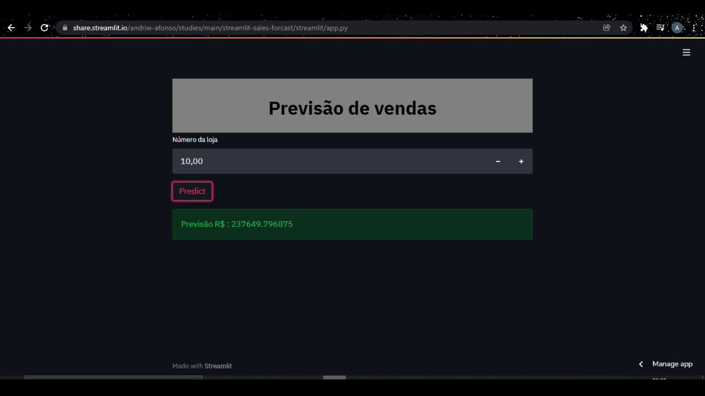

# Previsão de vendas
Previsão de vendas para os próximos 30 dias utilizando machine learning.

# Introdução:

Atualmente com a evolução das tecnologias as empresas necessitam de serem cada vez mais assertivas para se manterem  competitivas, pensando nisso, irei utilizar de ferramentas de machine learning para calcular a demanda de vendas das lojas das próximas 6 semanas.

## Problema de negócio:
O CFO da empresa fez uma reunião com todos os Gerentes de loja e pediu para que cada um deles trouxesse uma previsão  das próximas 6 semanas de vendas, o motivo do pedido é porque ele quer administrar o melhor possível o budget para a reforma das lojas.
Depois dessa reunião, todos os gerentes entraram em contato com você, e requisitaram uma previsão de vendas de sua loja.

## Features disponíveis:
- Número e tipo da loja
- Sortimento dos produtos
- Quantidade de clientes
- Loja fechada ou aberta 
- Dia da semana
- Promoção 1 e 2
- Se está em dia útil ou feriado 
- Distância entre os competidores
- Tempo de abertura de lojas concorrentes (mês e ano)
- Promoção 1 e 2
- Tempo após a promoção 2 (mês e ano)
- Meses em promoção

## Métricas a serem superadas:
### Modelo de média móvel:
- MAE:   1354,8
- MAPE:  0,45
- RMSE:  1835,13

# Proposta de solução:
## Definição da entrega:
- Dashboard com os insights mais relevantes para o negócio.
- Aplicação Web, onde o gerente irá inserir o número da loja e verificar a previsão de vendas.
- Demonstração de melhoria das métricas.

## Tecnologias empregadas:
- Linguagem : Python 3.7.12
- Principais bibliotecas: sklearn, xgboost, flask,
seaborn, requests, pandas, e numpy.
- Ide: Google colab
- Backend da aplicação : Streamlit
- Cloud da aplicação (ML) : Heroku
- Mapas mentais: Google coggle
- Dashboard: PowerBI
- Imagens: Canva
- Versionamento de código: GitHub
- Modelo escolhido : XGBoost Regressor
## Desafios enfrentados:
### Dados faltantes :
- Distância entre competidores
- Competidores abertos no mês 
- Competidores abertos no ano
- Semanas após a promoção 2 
- Anos após a promoção 2

### Tempo excessivo de treino dos algoritmos Random forest  e Extra trees :
- Foi escolhido a XGBoost devido o menor custo computacional envolvido.

# Resultados:
## Insights:
### Features com maiores impactos no fenômeno :
- Número de clientes, lojas abertas, dias da semana, promoções.

### Features que existem correlação entre si (Escala de 0,0 há 1,0):
- Número de clientes  e Lojas abertas (0,65)
- Tipo da loja e o assortment (0,52)
- Promoções e Número de clientes (0,32)

### Quebra de paradigmas:
#### Lojas vendem:
- Menos aos finais de semana.
- Mais depois do dia 10 de cada mês.
- Mais no primeiro semestre do ano.
- Menos nos feriados de natal.
- Mais com competidores mais próximos.

## Produto de Machine learning:
### Métricas atingidas:
- MAE:   889.07
- MAPE:  0.13
- RMSE:  1263.10

### Desempenho de negócio:

### Demonstração da aplicação:
 - Através do fornecimento de um link ,o  gerente é levado a uma página web onde é possível a inserção do número da loja, após o clique no botão "predict", é gerada a previsão de vendas para os próximos 30 dias.

#### Link da aplicação :
https://share.streamlit.io/andriw-afonso/studies/main/streamlit-sales-forcast/streamlit/app.py

# Próximos passos:
- Coletar e armazenar dados  dos clientes para encontrar melhores features para o retreino do modelo.

# Referências

- Meigarom Lopes . Canal no youtube, https://www.youtube.com/c/SejaUmDataScientist
- Meigarom Lopes, Blog, https://sejaumdatascientist.com/
