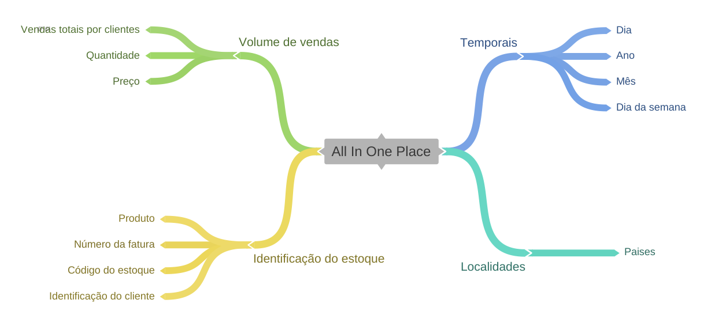
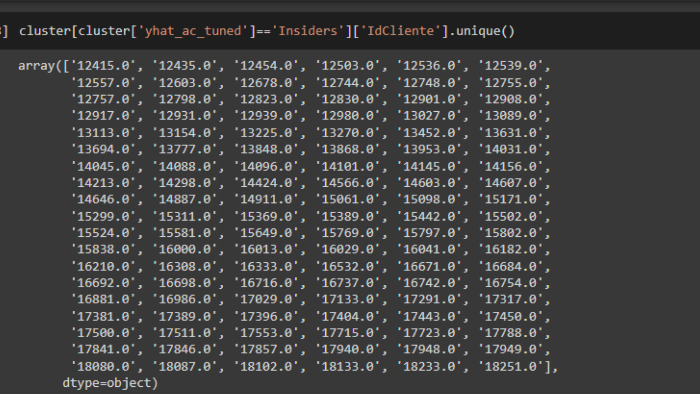
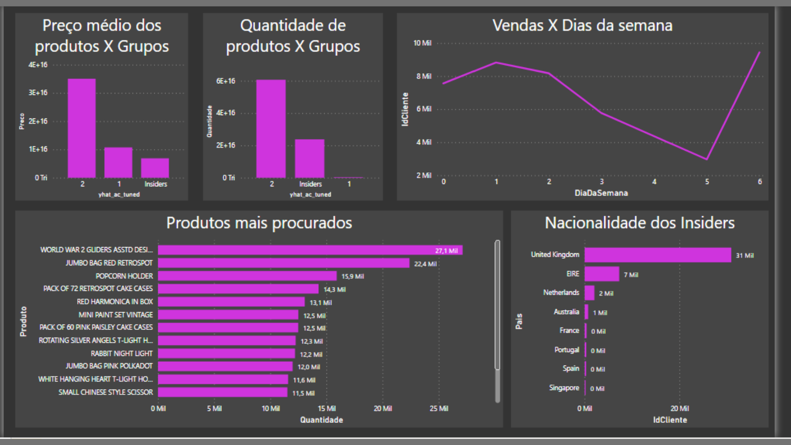
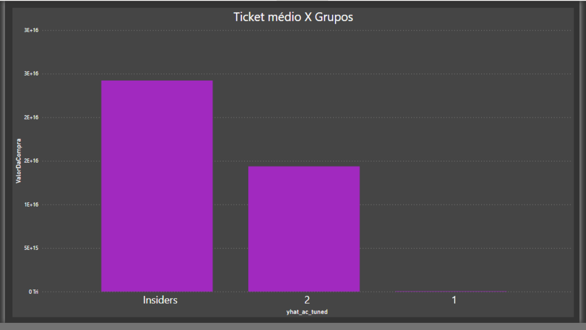
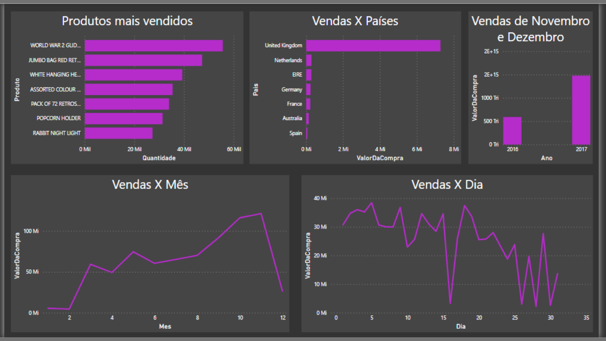
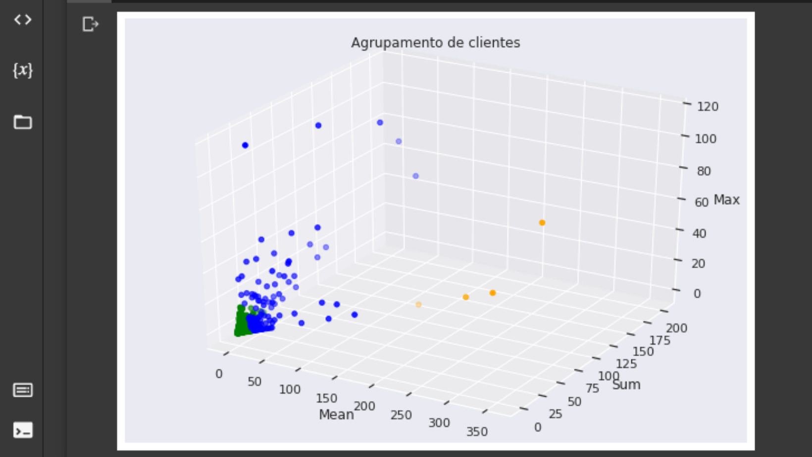

# Introdução:

Atualmente as empresas do mercado de varejo, necessitam cada vez mais melhorarem suas margens para se manterem competitiva, pensando nesse desafio, resolvi com o auxílio de técnicas de machine learning ,encontrar em uma base de dados os melhores clientes para ajudar o time de market a terem melhores estratégias.

## Desafio:
Você faz parte do time de cientistas de dados da empresa All In One Place, que precisa determinar quem são os clientes elegíveis para participar do Insiders. Em posse dessa lista, o time de Marketing fará uma sequência de ações personalizadas e exclusivas ao grupo, de modo a aumentar o faturamento e a frequência de compra.

## Features disponíveis:
- InvoiceNo : Número da fatura (um número integral de 6 dígitos atribuído exclusivamente a cada transação)
- StockCode :  Código do produto (item)
- Descrição : Nome do produto (item)
- Quantidade : As quantidades de cada produto (item) por transação.
- DataFatura : O dia em que cada transação foi gerada.
- PreçoUnitário : Preço unitário (preço do produto por unidade)
- CustomerID :  Número do cliente (ID exclusivo atribuído a cada cliente)
- País : Nome do país (O nome do país onde cada cliente reside)

## Métricas a serem superadas:
### Base line (AVG):
- Silhouette:        0.021
- DaviesBouldin:     2.041
- CalinskiHarabasz:  148.029

# Proposta de solução:
## Definição da entrega:
### Relatório com as seguintes perguntas respondidas:
- Quem são as pessoas elegíveis para participar do programa de Insiders ?

- Quantos clientes farão parte do grupo?
- Quais as principais características desses clientes ?
- Qual a porcentagem de contribuição do faturamento, vinda do Insiders ?
- Qual a expectativa de faturamento desse grupo para os próximos meses ?
- Quais as condições para uma pessoa ser elegível ao Insiders ?
- Quais as condições para uma pessoa ser removida do Insiders ?
- Qual a garantia que o programa Insiders é melhor que o restante da base ?
- Quais ações o time de marketing pode realizar para aumentar o faturamento?

## Tecnologias empregadas:
- Linguagem : Python 3.7.12
- Principais bibliotecas: sklearn,
seaborn, pandas, e numpy.
- Ide: Google colab
- Mapas mentais: Google coggle
- Dashboard: PowerBI
- Imagens: Canva
- Versionamento de código: GitHub
- Modelo escolhido : K-means
## Desafios enfrentados:
### Limpeza: 
-  Muitos NA's na identificação do cliente, valores negativos nas features preço e quantidade.
### Modelagem:
-  Foi necessário agrupar as features por clientes para fazer a clusterização.
### Data preparation:
- Foi criado 3 dimensões a partir da feature principal (Mean, Sum, Max).

# Resultados:
## Relatório:
### Quem são as pessoas elegíveis para participar do programa de Insiders ?

### Quantos clientes farão parte do grupo?
- 114 pessoas

###  Quais as principais características desses clientes ?

### Qual a porcentagem de contribuição do faturamento, vinda do Insiders ?
-  30.84 %

### Qual a expectativa de faturamento desse grupo para os próximos meses ?
- R$ 1008434.67

###  Quais as condições para uma pessoa ser elegível ao Insiders ?
- Ter gasto na loja R$ 23389.23 no ano de 2017.

###  Quais as condições para uma pessoa ser removida do Insiders ?
- Ter gasto menos de R$ 12005.17 em compras nos próximos 6 meses.

###  Qual a garantia que o programa Insiders é melhor que o restante da base ?

###  Quais ações o time de marketing pode realizar para aumentar o faturamento?
- Desconto e promoções nos produtos mais procurados.
- Intensificar a propaganda nos países da EIRE, Netherlands, Autralia e Portugal, France.
- Promover promoções relâmpago  nas terças e domingo.
## Insights:

### Quebra de paradigmas:
- O maior período de vendas não ocorre aos finais de semana, mas as segundas e quartas-feiras.

## Produto de Machine learning:
### Métricas atingidas:
- Silhouette:        0.910
- DaviesBouldin:     0.774
- CalinskiHarabasz:  3910.365

# Próximos passos:
- Implementar algoritmos de clusterização hierárquica nos produtos para encontrar similaridades e fazer recomendações.

# Referências

- Meigarom Lopes, Como criar um Programa de Fidelidade para empresa?
 https://sejaumdatascientist.com/como-criar-um-programa-de-fidelidade-para-empresa/
